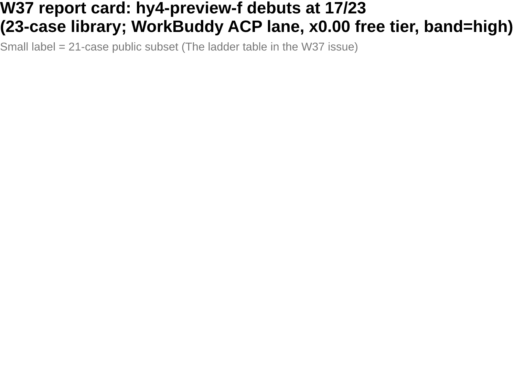

# amber-workbuddy

Running the private **AMBER** benchmark against catalog models on the WorkBuddy (CodeBuddy) ACP lane — the ACP mode of Tencent's CodeBuddy CLI, with a server-pushed model catalog (named models plus alias tiers). Results are public; questions are not.
中文：[README.md](README.md)

## What this is

- One `results/YYYY-Www.md` per edition: same questions, same harness, full library per model; models on the same lane side by side.
- Each edition pins: library size and hashes, per-case defect-hunt score and pass/fail, terminal states, token usage where the lane reports it (this lane does not — wall clock stands in), latency, environment fingerprint, and qualitative verdicts written under evidence discipline.
- Questions, oracles, transcripts and intermediate artifacts are **never published** (see "Publishing rules").
- Sister repos: [amber-gpt](https://github.com/getaskclaw/amber-gpt), [amber-crof](https://github.com/getaskclaw/amber-crof), [amber-ollama](https://github.com/getaskclaw/amber-ollama), [amber-devin](https://github.com/getaskclaw/amber-devin), [amber-opencode](https://github.com/getaskclaw/amber-opencode), [amber-commandcode](https://github.com/getaskclaw/amber-commandcode), [amber-deepseek](https://github.com/getaskclaw/amber-deepseek), [amber-doubao](https://github.com/getaskclaw/amber-doubao), [amber-goldenpotato](https://github.com/getaskclaw/amber-goldenpotato), [amber-kimi](https://github.com/getaskclaw/amber-kimi), [amber-stepfun](https://github.com/getaskclaw/amber-stepfun). Scores for the same deepseek-v4.1 family on official/relay lanes live in those repos; this repo's comparison axis is **across models on the WorkBuddy ACP lane**. Cross-repo citations always carry date and band.
- AMBER is an agentic field benchmark (build / ops / review / vision / requirement-drift); spec and authoring tools at [getaskclaw/amber](https://github.com/getaskclaw/amber); the questions themselves are private.

## W37 in one minute

Same ACP lane, same high band, same 23 cases and hashes: **hy4-preview-f 17/23** (build 5/6 + OPS 6/6 sweep + ui-build 12/12), **deepseek-v4.1-flash 15/23** (A-be92627f 9/9 — first-ever pass on that case; second verify-face pass overall). Per-case matrix and lane ledger in the [2026-W37 issue](results/2026-W37.md). Chart sources live beside the PNGs (`docs/images/`, Vega-Lite).

## Publishing rules (red lines)

1. Publish only: scores and aggregates, token usage (where the lane reports it), speed, qualitative verdicts.
2. Never publish: question content, oracles/graders, transcripts, candidate workspaces, any intermediate that could reconstruct a question.
3. Every edition pins: model ID, effort band, date (UTC), harness version, per-case content hash (bundle_sha) — checkable against the public hash index in [amber](https://github.com/getaskclaw/amber).
4. Case IDs and question structure are private: published results use only stable aliases (A-xxxxxxxx, hash-derived) plus bundle hashes as handles; internal case IDs, variant names, and question descriptions never appear.
5. Tone: this is a community measurement, not an attack on any vendor. Data speaks; wording stays restrained.

## A methodological caveat

Same model name, same provider, two runs can still differ — sampling parameters, load, and server-side versions all drift; relay/aggregator lanes add a framing layer on top. Every conclusion here carries a date and a band, and lanes get re-measured regularly. A single day's number is a snapshot, not a law.

## Results index

| Edition | Candidate | Score (23 cases / 21-case public subset) | One-liner |
|---|---|---|---|
| [2026-W37](results/2026-W37.md) | **hy4-preview-f** (x0.00 free tier) | **17/23** (15/21) | Second-tier entry on debut; OPS 6/6 sweep + ui-build 12/12; verify 0/3, review/vision still fail |
| [2026-W37](results/2026-W37.md) | deepseek-v4.1-flash (x0.00 free tier) | **15/23** (13/21) | A-be92627f 9/9 = first-ever pass on that case (second verify-face pass overall); one case below its official-GA sibling with swapped structure |

## Disclaimer

No affiliation with or sponsorship by Tencent or CodeBuddy/WorkBuddy. Scores are snapshots of a specific week and band, not purchasing advice.
