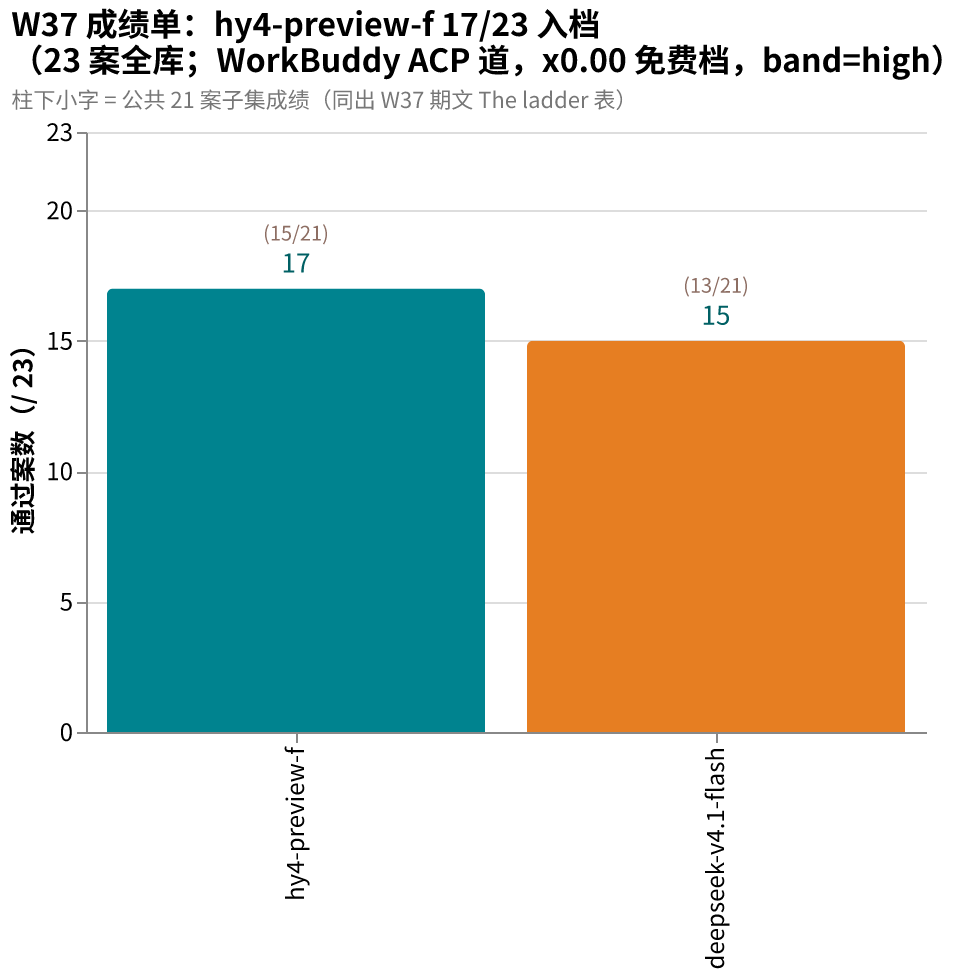
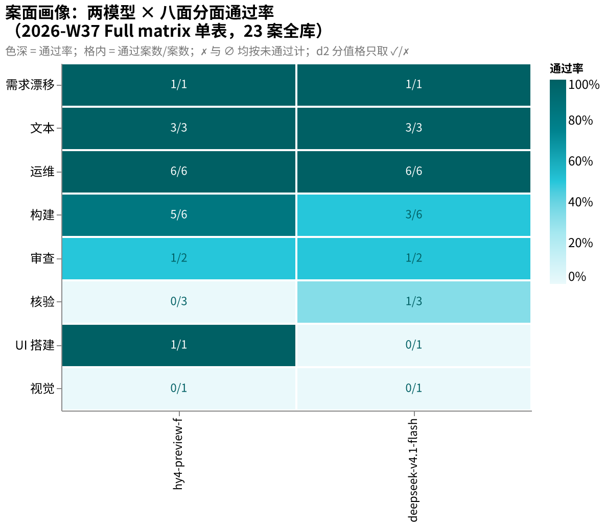

# amber-workbuddy

用私有题库 **AMBER** 实测 WorkBuddy(CodeBuddy)ACP 车道的目录模型（腾讯 CodeBuddy CLI 的 ACP 模式，服务端下发模型目录，含具名模型与别名档），只公开结果，不公开题目。
English: [README.en.md](README.en.md)

## 这是什么

- 「道」= 同一个模型名在不同家的卖场/接口；「案」= 一道题，「卷」= 一场考试记录（一案多卷 = 一道题的几个变体场次）。

- 每期一篇 `results/YYYY-Www.md`：同题、同 harness（跑考试并记分的程序），对目标模型跑全库；同车道跨模型并排。
- 一期固定报告：题集规模与哈希、每案找茬分（d2 分，我们的打分，算法不公开）与通过/失败、终端终态（程序跑完时的退出状态）、token 用量（若车道上报——本道不上报，以墙钟代替）与时延、环境指纹、按证据纪律写的定性裁决。
- 题目、oracle（判分器）、transcript（答题全过程记录）、中间产物**永不公开**（见下「发布纪律」）。
- 姐妹仓：[amber-gpt](https://github.com/getaskclaw/amber-gpt)（GPT 系周测）、[amber-crof](https://github.com/getaskclaw/amber-crof)（CrofAI 周测）、[amber-ollama](https://github.com/getaskclaw/amber-ollama)（Ollama Cloud 周测）、[amber-devin](https://github.com/getaskclaw/amber-devin)（Devin 周测）、[amber-opencode](https://github.com/getaskclaw/amber-opencode)（OpenCode Go 道）、[amber-commandcode](https://github.com/getaskclaw/amber-commandcode)（CommandCode 道）、[amber-deepseek](https://github.com/getaskclaw/amber-deepseek)（DeepSeek 官方道）、[amber-doubao](https://github.com/getaskclaw/amber-doubao)、[amber-goldenpotato](https://github.com/getaskclaw/amber-goldenpotato)、[amber-kimi](https://github.com/getaskclaw/amber-kimi)、[amber-stepfun](https://github.com/getaskclaw/amber-stepfun)。同一个 deepseek-v4.1 家族在官方/转发道的成绩见对应仓库；本仓的对照轴是 **WorkBuddy ACP 车道跨模型**，跨仓引用一律带日期与档位声明。
- AMBER 是 agentic 实战题库（施工/运维/审查/视觉/需求漂移——题中要求中途变化），规范与制题工具见 [getaskclaw/amber](https://github.com/getaskclaw/amber)；考题本体私有。

## 一分钟看懂 W37

同一 ACP 车道、同 high 档、同 23 案同哈希：**hy4-preview-f 17/23**（A-be92627f 外的核验面仍挂，但施工 5/6 + OPS 6/6 + UI 12/12）、**deepseek-v4.1-flash 15/23**（核验案 A-be92627f 9/9 = 该案史上首个过案、核验面第二席）。逐案矩阵与车道账本见 [2026-W37 期文](results/2026-W37.md)。图源与 PNG 同目录（`docs/images/`，Vega-Lite）。

> ⚠️ **三值化预览**（W38 更正特刊草稿 · 未签发 · 本草稿分支仅供审阅）：整数成绩将改写为「确认过 / 确认挂 / 挂起区间」。本仓：改判 0 格、挂起 1 格（挂起格只可能上移，补考前不计任何聚合、不给新名次）。另：假绿双向审计（WO-BRAIN）未开庭，现有 ✓ 格含「假及格」风险，特刊将如实标注。

## 发布纪律（红线）

1. 只发：分数与聚合、token 用量（若车道上报）、速度、定性裁决。
2. 永不发：题目内容、oracle/判分器、transcript、考生工作区、任何能复原题面的中间产物。
3. 每期必钉：模型 ID、effort 档（思考力度档位）、日期（UTC）、harness 版本、每案内容哈希（bundle_sha，每题内容的哈希指纹）。哈希用于对照 [amber](https://github.com/getaskclaw/amber) 的公开哈希清单，自证题集未变。
4. 案号与题目结构属私有面：公开结果里案例只用稳定别名（A-xxxxxxxx，哈希派生）+ bundle 哈希作句柄；内部案号、变体名、题目描述永不出现。
5. 基调：这是社区实测，不是对厂商的攻击。数据说话，措辞克制。

## 一个方法论前提

同名模型、同 provider，两次跑也可能不同分——推理参数、负载、服务端版本都在漂；转发/聚合车道还多一层装帧差。所以这里的一切结论都带日期与档位，且定期重测。单日数字是快照，不是定律。

## 图说数据

- **案面画像**（2026-W37 Full matrix 单表，face × 模型热力图，色深 = 分面通过率）：hy4 施工 5/6、运维 6/6、UI 1/1 为强项；d41f 核验 1/3 靠 A-be92627f 满分破冰；两模型视觉面均 0/1。
  

## 结果索引

| 期 | 考生 | 成绩（23 案 / 公共子集 21） | 一句话 |
|---|---|---|---|
| [2026-W37](results/2026-W37.md) | **hy4-preview-f**（x0.00 免费档） | **17/23**（15/21） | 入档即第二梯队；OPS 6/6 + UI 12/12 满分；核验 0/3，审查/视觉仍挂 |
| [2026-W37](results/2026-W37.md) | deepseek-v4.1-flash（x0.00 免费档） | **15/23**（13/21） | A-be92627f 9/9 = 该案史上首个过案（核验面第二席）；同脑比官方 GA 道低一案，结构互换 |

## 免责

与腾讯、CodeBuddy/WorkBuddy 无任何隶属/赞助关系。分数是特定周、特定档位的快照，不构成采购建议。
